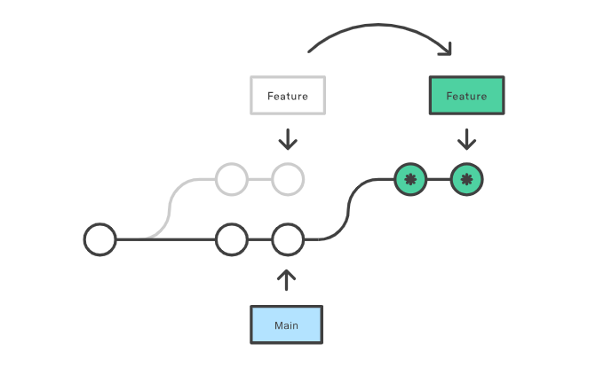

# Tuần 1

## Thứ 7

Đọc lại chương 2 react.dev

## Thứ 6

1. Đọc tiếp doc react.dev

?> State dạng object / array thì không nên thay đổi state gốc (gọi là mutate), mà nên tạo 1 bản sao rồi replace state với bản sao đấy (gọi là immutate)

2. Báo cáo tiến độ đọc doc react: không biết nhiều chỗ, đọc lại phần 2 3

?> **phần state rất quan trọng**, còn nhiều chỗ chưa hiểu
<br><br>**typescript: as const** nghĩa là gán biến đó theo đúng những gì dữ liệu nó đang thể hiện

## Thứ 5

1. Tiếp túc viết document hướng dẫn cho phần mềm qltl
2. Đọc document react.dev phần:

3. Adding Interactivity – React:

- event handler như click mouse, press button,… đã gặp nhiều nên không có gì lạ
- useState: Dùng nhiều rồi nên cũng quen thuộc
- Quy trình khi mở 1 website: React sẽ gửi 1 yêu cầu render (Trigger) > Render 1 component (Render) > Gắn vào cây DOM và hiển thị cho người dùng (commit)
- Phần state as a snapshot: state nó giống như 1 bản chụp mỗi lần render, mỗi lần render react sẽ lưu 1 giá trị của state cố định trong suốt lần render đó
- Thư viện "use-immer": "0.5.1": Dùng để rút gọn code khi onChange value trong form
  Taij sao không được để state trong 1 condition, function block

## Thứ 4

1. Đọc doc và build app đơn giản với docsify: [Link](https://nguyenminhnhat843.github.io/Docsifybasic/)
1. Hiểu đc basic về các cú pháp markdown, docsify (search, navbar, sidebar, coverPage, các thuộc tính config cho index.html như loadNavbar, loadSidebar,….), sau đó host lên github page

1. Đọc tiếp react.dev (Đọc phần Responding to Events – React)
1. Bắt đầu làm phần tài liệu hướng dẫn cho phần mềm Quản lý tài liệu, công việc gồm chỉnh sửa nội dung và chụp các hình ảnh mới của web
1. **Pull request:** khi mình có 1 nhánh riêng để code thêm gì đó, sau đó muốn merge vào nhánh chính, thay vì tự merge lại (trong dự án sẽ ko có quyền hoặc không được phép tự merge) mà phải gửi 1 thông báo tới chủ repo để họ review và pull code vào nhánh chính
1. Các loại merge code
   1. **Merge commit:** Khi merge git tạo 1 commit mới gọi là commit merge và lấy tất cả commit của nhánh merge giữ nguyên và thêm vào nhánh chính ==> rõ ràng hơn nhưng cũng dễ rối hơn do nhiều commit
   2. **Squash merge:** Ngược với merge commit, squash commit sẽ gộp tất cả commit trong nhánh merge lại thành 1 commit duy nhất và merge ==> gọn gàng hơn
   3. **Rebase merge:** Là git sẽ lấy commit của nhánh merge, đưa vào nhánh chính luôn như thể chưa từng rẽ nhánh
      

## Thứ 3

- Tiếp tục đọc react.dev:

!> Không nên thay đổi props trực tiếp trong component con vì sẽ gây lỗi
<br><br> Trong react có thể mô hình hóa dưới dạng cây theo 2 cách:

**Các loại cây trong react**

1.  **The Render tree:** vẽ các components cha và các components con được cha render ra

2.  **The Module Dependency Tree:** vẽ các node cha và node con được import bởi node cha
    Đọc thêm:Understanding Your UI as a Tree – React

## Thứ 2

- Đọc document Maintine – FrameWork UI dùng cho dự án sắp tới
- Code 1 ứng dụng đơn giản dùng Maintine cho phần UI, dùng component Table cho việc hiên thị dữ liệu
- Đọc document react: Passing Props to a Component – React

* Pasing props to component: Truyền prop từ prent tới children quá quen thuộc nhưng có 1 cú pháp:

```bash
<Card /> // Cú pháp bình thường khi gọi 1 function component

<Card></Card> : Gọi theo 2 tag đóng/mở nghĩa là nó đang lấy mọi thứ bên trong truyền vào props children
```

```bash
function ButtonUploadImage() {
  return (
    <Button onClick={() => alert('upload image')}>
      <div style={{ color: 'red' }}>
        <p>upload image</p>
      </div>
    </Button>
  );
}

function Card({ children }: { children: any }) {
  return <div style={{backgroundColor: 'red', padding: '12px'}}>{children}</div>;
}

function App() {
  return (
    <div>
      <Card>
        <span>Đây là 1 card</span>
        <ButtonUploadImage />
      </Card>
    </div>
  );
}
```

- Condition rendering: cái này là render tùy theo điều kiện nào đó, cũng đã gặp nhiều nên không có gì mới
- rendering lits: nói về việc render dữ liệu từ 1 array với method filter/map, cũng thường xuyên sử dụng nên dễ hiểu

!> Mỗi item khi map, key truyền vào phải là duy nhất và không nên thay đổi, nếu dùng index để đánh key có thể sẽ gây lỗi
